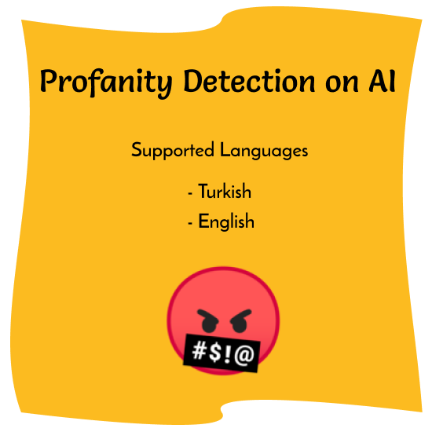

# Profanity Detection
Artificial Intelligence profanity detection service with [brain.js](https://github.com/BrainJS/brain.js).

## Need The Data File
First need the profanity and non-profanity data file containing the structure below in the **root** folder with `data.json` name.
> The content will be yours!
>
> Use the right data!!!

    [
        {
            "input": "f*** you",
            "output": 0.97,
        },
        {
            "input": "how are you?",
            "output": 0.1,
        },
        {
            "input": "son of the b****",
            "output": 0.88,
        },
        .
        .
        .
    ]

* And also you need a test data like 20% for test 80% for training.

## Installation and Usage

> mkdir **profanity-detection**
> 
> cd **profanity-detection**
> 
> git clone https://github.com/crazycoder-io/profanity-detection **.**
>
> node **train.js**
> 
> node **index.js**